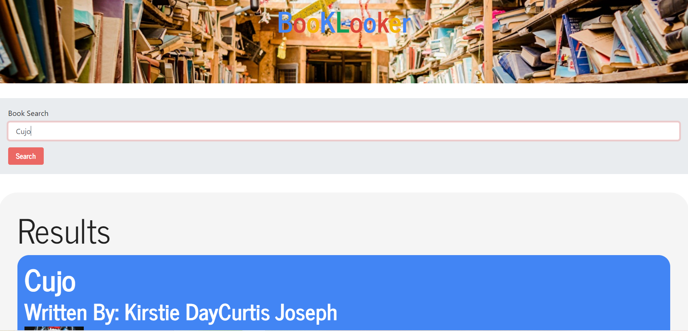

# Book-Looker

MERN application in which the user can search Google Books database, and save search.

## Links
Demo: https://dashboard.heroku.com/apps/pure-beyond-58

[Repo](https://github.com/kelsie51/Book-Looker)

[Deployed](https://kelsie51.github.io/Book-Looker/)

## Description
This project was bootstrapped with [Create React App](https://github.com/facebook/create-react-app).NPM Packages Express, Axios, Mongoose

## Installation
Clone the repository.
 git clone https://github.com/kelsie51/Book-Looker.git
In the root directory of the project, start the app.
npm start

## Usage

Open [http://localhost:3000](http://localhost:3000) to view it in the browser.

## License
Licensed under the MIT

## Screenshots

A page load screenshot:

